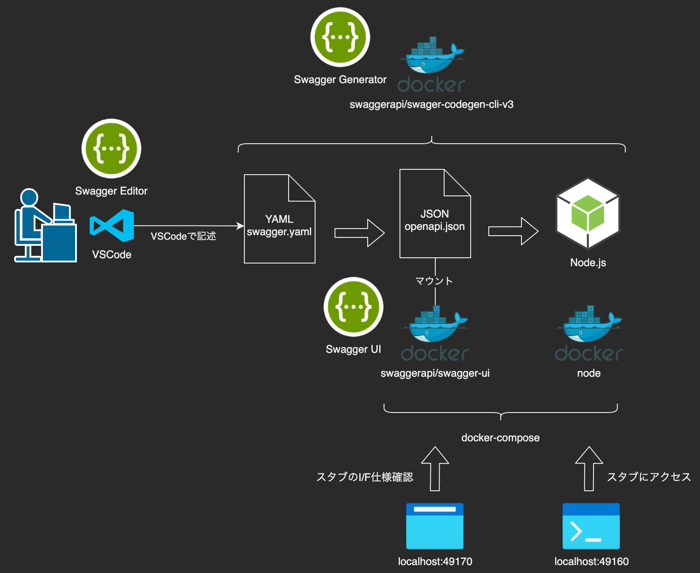

# 【Swagger】Docker環境で簡易モッキング

`Swagger`で定義したAPI仕様を使ってスタブ（モック）サーバーを構築します。こちらのソースコードを使って説明していきます。

* https://github.com/takiguchi-yu/SwaggerMocking

## アーキテクチャ

流れは以下の通りになります。

1. 開発者は VSCode を使って swagger.yaml を記述する
1. swagger-codegen を使って yaml を json に変換する
1. 変換した json を使ってスタブサーバーのコードを生成する
1. docker-compose up をしてスタブサーバーを実行する



## ディレクトリ構成

```bash
.
├── Dockerfile            # Node.jsのDockerイメージ
├── docker-compose.yml    # Swagger UIとNode.jsのコンテナ起動
├── gen                   # Swagger Generatorの出力ファイル
│   └── out
├── run-in-docker.sh      # Swagger Generator実行ファイル用シェル
└── swagger               # Swaggerファイル
    └── swagger.yaml
```

## swagger.yamlを作成

swagger.yamlはVSCodeで記述していきます。以下の拡張機能をインストールすることで快適になります。

* [Swagger Viewer](https://marketplace.visualstudio.com/items?itemName=Arjun.swagger-viewer)
  * Swaggerファイルをプレビューできるようになります。
* [OpenAPI (Swagger) Editor](https://marketplace.visualstudio.com/items?itemName=42Crunch.vscode-openapi)
  * 自動補完(IntelliSense)が効いてくれるようになります。

### サンプル

```yaml:swagger/swagger.yaml
openapi: '3.0.2'
info:
  title: 簡単なAPI
  version: '1.0.0'
servers:
- url: http://localhost:49160/v1
externalDocs:
  description: Find out more about Swagger
  url: https://swagger.io/specification/
tags:
- name: List
  description: 一覧画面で使うAPI
paths:
  /list:
    get:
      tags:
      - List
      summary: 一覧情報を取得するAPI
      operationId: getList
      parameters:
      - name: listId
        in: query
        description: 一覧ID
        schema:
          type: string
      responses:
        '200':
          description: 処理成功
          content:
            application/json:
              schema:
                type: object
                properties:
                  status:
                    type: string
                    example: '200'
```

## コード生成

スタブサーバーで使うソースコードを swagger.yaml から生成します。

```bash
./run-in-docker.sh --help   # swagger-codegen-cliに対して「help」コマンドを実行します
./run-in-docker.sh langs    # swagger-codegen-cliに対して「langs」コマンドを実行します

# yaml to json
./run-in-docker.sh generate \
  -i /swagger/swagger.yaml \
  -o /gen/out/openapi \
  -l openapi

# swagger server generate
./run-in-docker.sh generate \
  -i /gen/out/openapi/openapi.json \
  -o /gen/out/nodejs-server \
  -l nodejs-server
```

## スタブサーバー起動

```bash
docker-compose up -d
```

## 動作確認

```bash
$ curl -X 'GET' \
           'http://localhost:49160/v1/list' \
           -H 'accept: application/json'

{
  "status": "200"
}
```

## 参考資料
* [OpenAPI仕様](https://swagger.io/specification/)
* [SwaggerCodegen仕様](https://github.com/swagger-api/swagger-codegen/tree/3.0.0)
  * ブランチはmasterではなく3.0.0に最新仕様が記述されています
* [Node.js Web アプリケーションを Docker 化する](https://nodejs.org/ja/docs/guides/nodejs-docker-webapp/)
